## Обов'язкові

### Task 1

> Виберіть будь-який сайт. Пройдіть шлях: dig → ip route get → traceroute -n

На даному етапі я обрав сайт місцевого провайдера зв'язку: campus.rv.ua
Хоча команда `dig` являється дуже хорошою - проте не входить в стандартну поставку певних дитсрубитувів
та повинна бути встановлена разом з пакетом `bind-tools` або ж `bind-utils` - детальніше дивіться в пакетах Вашого дистрибутиву.

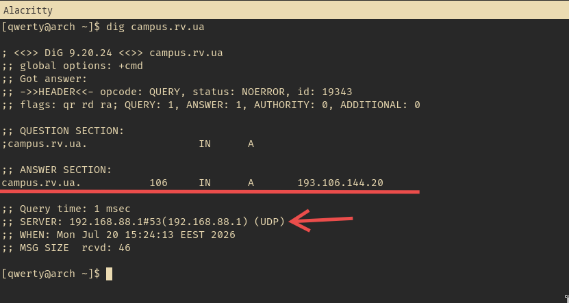
В даному випадку ми бачимо запит та відповідь у виводі утиліти, а також адресу серверу, який опрацював запит.

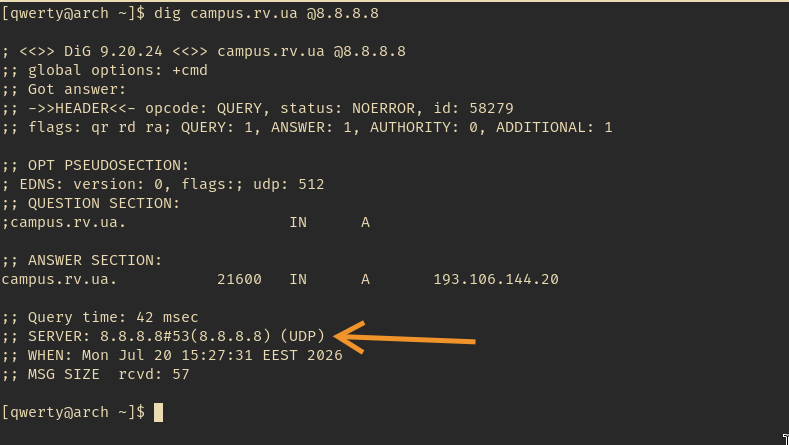
Також ми можемо вказати іншийц сервер використовуючи конструкцію типу `@1.1.1.1` в рядку команди.
Або скоротити вивід додавши опцію `+short`
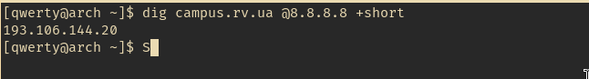

Оскільки мій пристрій має одне мережеве підключення - він вказує лише його, як варіант оптимального шляху.
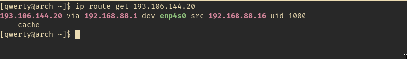
Проте, якби в мене було VPN з'єднання до іншого серверу - можливо шлях був би інший.

В даному випадку, оскільки провайдер місцевий і потужності знаходяться локально - кількість хопів в трасуванні шляху невелика:
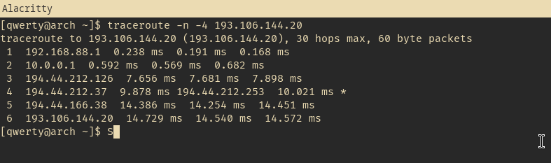

Проте у випадку з IPv6 - результат очікувано зовсім інший:
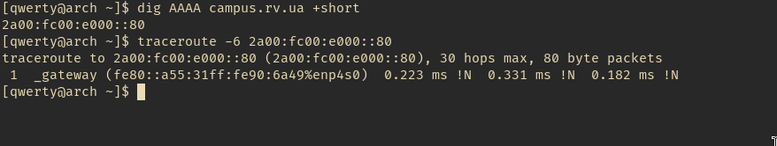

### Task 2

> Зніміть tcpdump під час curl. Знайдіть у виводі SYN, SYN-ACK, ACK

В даному випадку я додав фільтрацію пакетів по адресі `193.106.144.20`, щоб не засмічувати вивід
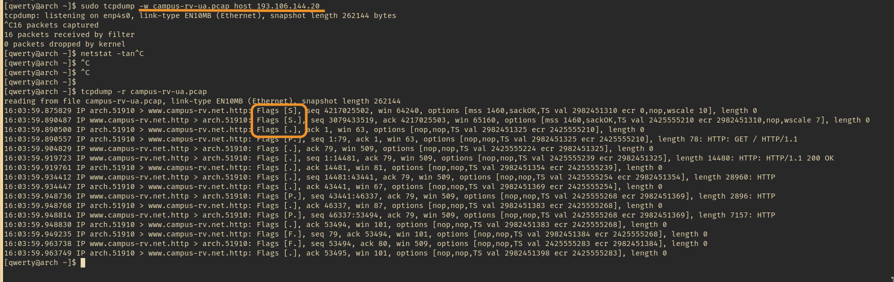
`tcpdump` позначає SYN, SYN-ACK, ACK, як `[S] [S.] [.]` відповідно - встановлення з'єднання позначено на скріншоті окремо

### Task 3

> Запишіть у файл: скільки хопів, який ваш шлюз, який MAC у шлюзу

На даному скріншоті за допомогою `ip addr` ми дізналися власну IP адресу
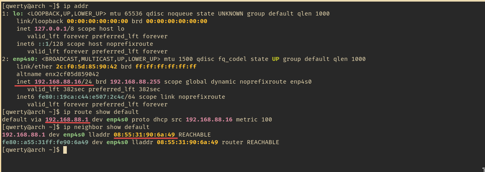
За допомогою `ip route show default` - наш дефолтний шлюз, та команда `ip neighbor show` видала нам його MAC адресу.

### Task 4

> Поясніть письмово в 5 реченнях, чому MAC змінюється, а IP — ні

Наскільки мені відомо повинно бути навпаки - MAC-адреса пристрою це стала величина, а от IP-адреса може змінюватися.
MAC-адреса це ідентифікатор пристрою, в якому закодовано ідентифікатор компанії (перші 3 октети).
Тому знаючи MAC-адресу девайсу ми можемо знайти виробника, за умови, що MAC не змінено.
IP-адреса девайсу зазвичай не є статичною та видається йому на час сесії.
За умови розриву сесії та повторного підключення - буде видано нову IP адресу з пулу доступних адрес, за умови, що адреса не видана статично.
Статична адреса може бути видана клієнту провайдером, якщо необхідна постійна адреса з доступом з глобальної мережі.
Або ж для прикладу для внутрішнього сервісу/серверу тощо.

## Додаткові

### Task 1

> Поставте Wireshark, зловіть той самий handshake з графічним інтерфейсом

WireShark вже відображає `SYN, SYN-ACK, ACK` на відміну від `tcpdump`
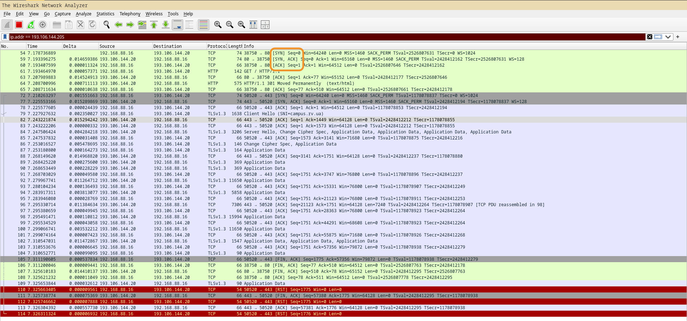
Я знову використав фільтр за адресою `ip.addr == 193.106.144.20` для фільтрування лише корисного трафіку.

### Task 2

> Зробіть nc -zv на 3 різні порти: відкритий, закритий, фільтрований. Порівняйте

В даному випадку для розуміння відкритий, закритий чи відфільтрований порт - краще дивитися в `tcpdump` додатково.
Відкитий порт поверне `SYN, SYN-ACK, ACK` пакети встановивши з'єдннання та закривши його потім.
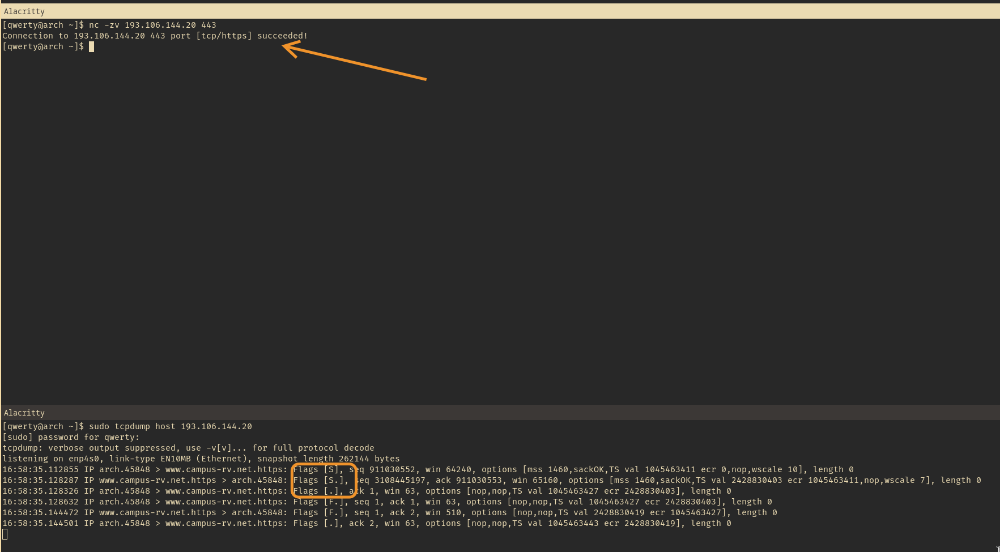

Закритий порт поверне `RST` пакет після першого `SYN`
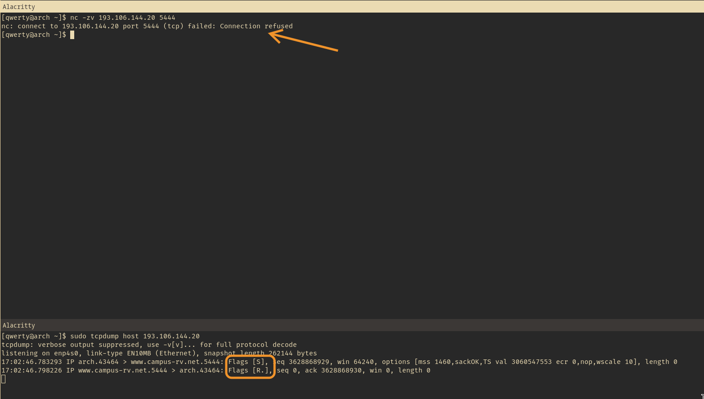

Та фільтрований порт буде ігнорувати `SYN` пакети та не давати жодної відповіді
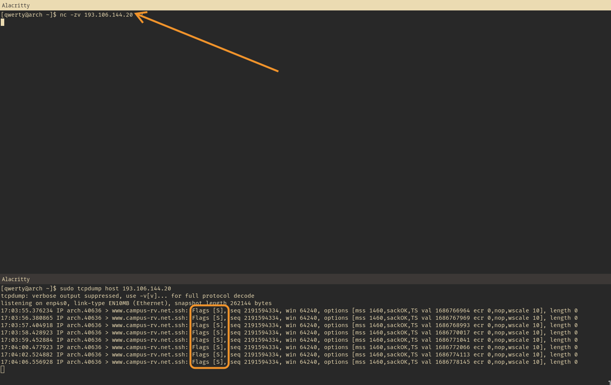

### Task 3

> Прочитайте про MTU і спробуйте ping -s з різними розмірами

MTU (Maximum Transmission Unit) - це значення, яке визначає скільки данних буде в пакеті/датаграмі, сегменті чи фреймі, а скільки простору займе службова інформація.
Значення MTU на 3-му рівні зазвичай менше, ніж на 2-му, тому що 3-й рівень включає в себе додатково дані та заголовки.
Дефолтно MSS (Maximum Segment Size) дорівнює 1460 байтів.
MTU 3-го рівня включає в собі 20+20 байтів заголовків 3-го та 4-го рівня, а також дані з MSS і дорівнює 1500  байтам.
MTU 2-го рівня також дорівнює 1500 байтам.
Дані заголовків та контрольна сума FCS не рахуються в MTU 2-го рівня.
MTU може бути більшим, для прикладу в Jumbo-фреймах чи тощо, але це має місце лише в корпоративних мережах де можна забезпечити однаковий розмір MTU на всіх девайсах.

Команда `ping -s` дозволяє нам задати розмір пакету, який буде відправлено по мережі.
Ця команда активно використовується при налаштуванні `port-knocking` правил.
Для прикладу, якщо було 3 послідовні пакети з наперед визначеним розміром, для прикладу: 140, 250 та 264 байти - додаємо цю адресу в білий список та відкриваємо для неї доступ на SSH на певний хост.
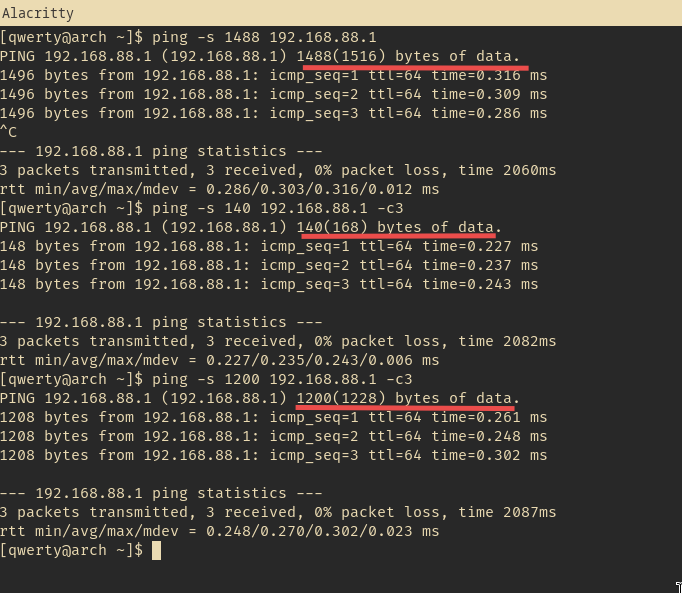

